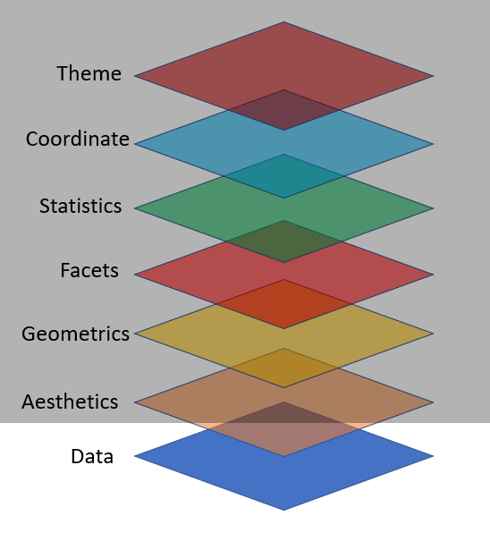

```{r setup, include=FALSE}
options(htmltools.dir.version = FALSE)
knitr::opts_chunk$set(collapse = TRUE,
                      fig.retina = 3,
                      echo = FALSE,
                      fig.align='center')
library(countdown)
library(ymlthis)
library(tidyverse)
library(ggthemes)
library(icons)
#library(icon)
library(xaringanExtra)
library(emoji)
library(palmerpenguins)
xaringanExtra::use_tachyons()
xaringanExtra::use_tile_view()
xaringanExtra::use_webcam()
xaringanExtra::use_fit_screen()
xaringanExtra::use_extra_styles(hover_code_line = TRUE, mute_unhighlighted_code = TRUE)
xaringanExtra::use_share_again()
xaringanExtra::use_panelset()
```

```{r meta, echo=FALSE}
library(metathis)
meta() %>%
  meta_general(
    description = "Ajay Koli - Aspiring Data Scientist",
    generator = "xaringan and remark.js"
  ) %>% 
  meta_name("github-repo" = "koliajaykr/r-training-vupune") %>% 
  meta_social(
    title = "R FOR BEGINNERS",
    url = "https://r4b-vu.netlify.app/",
    image = "https://r4b-vu.netlify.app/images/social-card.png",
    og_type = "talk",
    og_author = "Ajay Koli",
    twitter_card_type = "summary_large_image",
    twitter_creator = "@ajay_kolii"
  ) %>%
  include_meta()
```

name: module3

class: title-slide, center, middle, hide-count, hide-logo

background-image: url("https://images.unsplash.com/photo-1617164924207-40e6ee7c3ffe?ixlib=rb-1.2.1&ixid=MnwxMjA3fDB8MHxwaG90by1wYWdlfHx8fGVufDB8fHx8&auto=format&fit=crop&w=1740&q=80")
background-size: cover

# .white.big-text[Data Visualisation]
## .white[Session - 3]

.footnote[
.white[Image credits:][Kayvan Mazhar](https://unsplash.com/photos/SfxhjdST3Qs)
]

---

class: center

# Course Progress

```{r echo=FALSE, out.width="100%"}
knitr::include_graphics("images/data-science-communicate.png")
```

---

class: left, middle, hide-count, hide-logo

background-image: url("images/not_normal.png")
background-size: 70%
background-position: right

# .big-text[Data]

.footnote[
[Artwork Source](https://www.allisonhorst.com/)
]

---

# Variable types in R:

--

- `int` stands for integers, like 4, 55, 300.

--

- `dbl` stands for doubles, or real numbers like 3, 7.45, 1.565, 12.

--

- `chr` stands for character vectors, or strings like names.

--

- `dttm` stands for date-times (a date + a time).

--

- `lgl` stands for logical, vectors that contain only TRUE or FALSE.

--

- `fct` stands for factors, which R uses to represent **categorical variables** with fixed possible values like occupation: student, professional, government, business.

--

- `date` stands for dates.

---

class: hide-logo

background-image: url("images/culmen_depth.png")
background-size: 25%
background-position: 95% 5%

# Data of Palmer Penguins

- It comes with R package `palmerpenguins`

--

- Name of the data is `penguins`

--

- To know more about the data `?penguins`

--

- Included variables are:
  - `r names(penguins)`


.footnote[
[Artwork Source](https://www.allisonhorst.com/)
]


---

# An Overview of Data

.panelset[

.panel[.panel-name[Codes]

```{r glimp, eval=FALSE, echo=TRUE}
glimpse(penguins) #<<
```

]

.panel[.panel-name[Output]

```{r ref.label="glimp", echo=FALSE}
```

]
]

---

### An Overview of Data

.panelset[

.panel[.panel-name[Codes]

```{r summ, eval=FALSE, echo=TRUE}
summary(penguins) #<<
```

]

.panel[.panel-name[Output]

```{r ref.label="summ", echo=FALSE}
```

]
]


---

# Packages required: 

```{r pkgs, eval=FALSE, echo=TRUE}
library(palmerpenguins) # to access penguin data
library(tidyverse) # to use ggplot2 pkg
```

- Packages recommended:

```{r more-pkgs, eval=FALSE, echo=TRUE}
install.packages(c(
  "directlabels", "dplyr", "gameofthrones", "ggforce", "gghighlight", 
  "ggnewscale", "ggplot2", "ggraph", "ggrepel", "ggtext", "ggthemes", 
  "hexbin", "mapproj", "maps", "munsell", "ozmaps", "paletteer", 
  "patchwork", "rmapshaper", "scico", "seriation", "sf", "stars", 
  "tidygraph", "tidyr", "wesanderson" 
))
```

---

class: left, middle, hide-count, hide-logo

background-image: url("images/ggplot-logo.png")
background-size: contain
background-position: 100% 50%

# .big-text[R<br>Package]

---

# ggplot2 by [Hadley Wickham](http://hadley.nz/)
<br>
- "is a system for declaratively creating graphics, based on [The Grammar of Graphics](https://www.springer.com/gp/book/9780387245447)" (book by Late Leland Wilkinson)

.pull-left[
```{r wilkinson, echo=FALSE, out.width="40%", fig.cap="Late Leland Wilkinson"}
knitr::include_graphics("https://upload.wikimedia.org/wikipedia/en/b/b5/Leland_Wilkinson.png")
```
]

.pull-right[
```{r hadley, echo=FALSE, out.width="58%", fig.cap="Hadley Wickham"}
knitr::include_graphics("images/hadley.jpg")
```
]

.footnote[
[Source](https://ggplot2.tidyverse.org/)
]

---
class: hide-count, hide-logo

background-image: url("images/layer7.png")
background-size: contain
background-position: 50% 50%

.footnote[
[Source](https://www.ericchowkokyew.com/data-visualization-with-ggplot2-in-r/)
]

---

# Key Components for ggplot2 Plot

1. data,

1. aesthetic mapping

1. at least one layer of geom function

---

.panelset[

.panel[.panel-name[Task]

```{r layer11, echo=FALSE, out.width="45%"}

```

]

.panel[.panel-name[Codes]

```{r imp-data1, eval=FALSE, echo=TRUE , echo=TRUE}
ggplot(data = penguins) #<<
```

]

.panel[.panel-name[Output]

```{r ref.label="imp-data1", echo=FALSE}
```

]
]

---

.panelset[

.panel[.panel-name[Task]

```{r layer2, echo=FALSE, out.width="45%"}
knitr::include_graphics("images/layer2.png")
```

]

.panel[.panel-name[Codes]

```{r aes, eval=FALSE, echo=TRUE}
ggplot(data = penguins, mapping = aes(x = species)) #<<
```

]

.panel[.panel-name[Output]

```{r ref.label="aes", echo=FALSE}
```

]
]

---

.panelset[

.panel[.panel-name[Task]

```{r layer3, echo=FALSE, out.width="45%"}
knitr::include_graphics("images/layer3.png")
```

]

.panel[.panel-name[Codes]

```{r geom-bar, eval=FALSE, echo=TRUE}
ggplot(data = penguins, mapping = aes(x = species)) +
  geom_bar() #<<
```

]

.panel[.panel-name[Output]

```{r ref.label="geom-bar", echo=FALSE}
```

]
]

---

.panelset[

.panel[.panel-name[Codes]

```{r geom-bar-pro, eval=FALSE, echo=TRUE}
ggplot(penguins, aes(x = species)) +
  geom_bar() 
```

]

.panel[.panel-name[Output]

```{r ref.label="geom-bar-pro", echo=FALSE}
```

]
]

---

class: your-turn, hide-logo

# `r emo::ji("brain")` YOUR TURN

```{r echo=FALSE}
countdown(minutes = 5, top = 0, font_size = "3em")
```

.panelset[

.panel[.panel-name[Output]

```{r ref.label="yt11", echo=FALSE, out.width="38%"}
```

]

.panel[.panel-name[Codes]

```{r yt11, eval=FALSE, echo=TRUE}
ggplot(data = penguins, mapping = aes(x = island)) +
  geom_bar() 
```

]
]

---

class: center, middle

# How to export plot to your computer?

---

.panelset[

.panel[.panel-name[Codes]

```{r export-plot, eval=FALSE, echo=TRUE}
ggplot(data = penguins, mapping = aes(x = species)) +
  geom_bar() 

ggsave("peng-species.pdf")  # also try jpg/jpeg/png #<<
```

]

.panel[.panel-name[Output]

```{r ref.label="export-plot", echo=FALSE}

```

]
]

---
class: center, middle

# How to add color to bars?

---

.panelset[

.panel[.panel-name[Codes]

```{r color, eval=FALSE, echo=TRUE}
ggplot(data = penguins, mapping = aes(x = species)) +
  geom_bar(fill = "blue") #<<
```

]

.panel[.panel-name[Output]

```{r ref.label="color", echo=FALSE}

```

]
]

---

.panelset[

.panel[.panel-name[Codes]

```{r colors, eval=FALSE, echo=TRUE}
ggplot(data = penguins, mapping = aes(x = species)) +
  geom_bar(fill = c("orange", "white", "green")) #<<

# color names should be equal to the factor levels
# in case of factor species levels are three
# Adele, Chinstrap & Gentoo
```

]

.panel[.panel-name[Output]

```{r ref.label="colors", echo=FALSE}

```

]
]

---

class: center, middle

# How to add color using palette? `r emo::ji("art")`

---

## `r emo::ji("art")` Color Palette

- R package `RColorBrewer` & `wesanderson`

```{r fig.retina=3, fig.width=17, fig.height=15}
library(RColorBrewer)
display.brewer.all()
```

---

.panelset[

.panel[.panel-name[Codes]

```{r palette, eval=FALSE, echo=TRUE}
library(RColorBrewer)

ggplot(data = penguins,
       mapping = aes(x = species,
                     fill = species)) + #<<
  geom_bar() +
  scale_fill_brewer(palette = "Dark2") #<<

```

]

.panel[.panel-name[Output]

```{r ref.label="palette", echo=FALSE}

```

]
]

---

class: center, middle

# How to remove legend or change its position?


---

.panelset[

.panel[.panel-name[Codes]

```{r legend, eval=FALSE, echo=TRUE}
ggplot(data = penguins,
       mapping = aes(x = species,
                     fill = species)) + 
  geom_bar() +
  scale_fill_brewer(palette = "Dark2") +
  theme(legend.position = "none") # top, bottom, left

```

]

.panel[.panel-name[Output]

```{r ref.label="legend", echo=FALSE}

```

]
]

---

class: center, middle

# How to plot title and axis titles?

---

.panelset[

.panel[.panel-name[Codes]

```{r labs, eval=FALSE, echo=TRUE}
ggplot(data = penguins,
       mapping = aes(x = species,
                     fill = species)) +
  geom_bar() +
  scale_fill_brewer(palette = "Dark2") +
  theme(legend.position = "none") +
  labs(
    title = "Species of palmer penguins",
    subtitle = "This data is about penguins",
    x = "Species",
    y = "Frequency"
  )

```

]

.panel[.panel-name[Output]

```{r ref.label="labs", echo=FALSE}

```

]
]

---

class: center, middle

# How to control size of text?

---

.panelset[

.panel[.panel-name[Codes]

```{r size, eval=FALSE, echo=TRUE}
ggplot(data = penguins,
       mapping = aes(x = species,
                     fill = species)) +
  geom_bar() +
  scale_fill_brewer(palette = "Dark2") +
  theme(legend.position = "none",
        text = element_text(size = 20)) + #<<
  labs(
    title = "Species of palmer penguins",
    subtitle = "This data is about penguins",
    x = "Species",
    y = "Frequency"
  )

```

]

.panel[.panel-name[Output]

```{r ref.label="size", echo=FALSE}

```

]
]

---

class: center, middle

# How to plot two numeric variables?

---

.panelset[

.panel[.panel-name[Codes]

```{r num, eval=FALSE, echo=TRUE}
ggplot(data = penguins,
       mapping = aes(x = bill_length_mm,
                     y = bill_depth_mm,
                     color = species)) +
  geom_point() +
  scale_fill_brewer(palette = "Dark2") +
  theme(legend.position = "none",
        text = element_text(size = 20)) + #<<
  labs(
    title = "Relationship between bill length \n& depth of palmer penguins",
    subtitle = "This data is about penguins",
    x = "Bill length (mm)",
    y = "Bith depth (mm)"
  )

```

]

.panel[.panel-name[Output]

```{r ref.label="num", echo=FALSE, warning=FALSE}

```

]
]

---

class: center, middle

# How to add themes to ggplot?

---

# ggplot2 themes 

<https://ggplot2.tidyverse.org/reference/ggtheme.html>

- theme_gray()

- theme_bw()

- theme_linedraw()

- theme_light()

- theme_dark()

- theme_minimal()

- theme_classic()

- theme_void()

- theme_test()

---

.panelset[

.panel[.panel-name[Codes]

```{r theme1, eval=FALSE, echo=TRUE}
ggplot(data = penguins,
       mapping = aes(x = bill_length_mm,
                     y = bill_depth_mm,
                     color = species)) +
  geom_point() +
  scale_fill_brewer(palette = "Dark2") +
  theme(legend.position = "none",
        text = element_text(size = 20)) + 
  labs(
    title = "Relationship between bill length \n& depth of palmer penguins",
    subtitle = "This data is about penguins",
    x = "Bill length (mm)",
    y = "Bith depth (mm)"
  ) +
  theme_bw() #<<

```

]

.panel[.panel-name[Output]

```{r ref.label="theme1", echo=FALSE, warning=FALSE}

```

]
]

---

.panelset[

.panel[.panel-name[Codes]

```{r theme2, eval=FALSE, echo=TRUE}
ggplot(data = penguins,
       mapping = aes(x = bill_length_mm,
                     y = bill_depth_mm,
                     color = species)) +
  geom_point() +
  scale_fill_brewer(palette = "Dark2") +
  theme(legend.position = "none",
        text = element_text(size = 20)) + #<<
  labs(
    title = "Relationship between bill length \n& depth of palmer penguins",
    subtitle = "This data is about penguins",
    x = "Bill length (mm)",
    y = "Bith depth (mm)"
  ) +
  theme_classic()

```

]

.panel[.panel-name[Output]

```{r ref.label="theme2", echo=FALSE, warning=FALSE}

```

]
]

---

class: center, middle

# How to add regression line to ggplot?

---

.panelset[

.panel[.panel-name[Codes]

```{r reg, eval=FALSE, echo=TRUE}
ggplot(data = penguins,
       mapping = aes(x = flipper_length_mm,
                     y = body_mass_g)) +
  geom_point() +
  theme(legend.position = "none",
        text = element_text(size = 24)) + 
  labs(
    title = "Relationship between bill length \n& depth of palmer penguins",
    subtitle = "This data is about penguins",
    x = "Flipper length (mm)",
    y = "Body mass (gm)"
  ) +
  theme_classic() +
  geom_smooth() #<<

```

]

.panel[.panel-name[Output]

```{r ref.label="reg", echo=FALSE, warning=FALSE, message=FALSE}

```

]
]

---

# More resources

- ggplot2 book https://ggplot2-book.org/

- CÉDRIC SCHERER https://www.cedricscherer.com/

- ggplot2 cook book http://www.cookbook-r.com/

---

class: center middle hide-count

#  `r emo::ji("woman_raising_hand_medium_skin_tone")``r emo::ji("man_raising_hand")`<br>.big-text[Q&A]

---

class: center, middle, inverse, hide-logo

# Dynamic Wrangling<br>Using dplyr
### .orange[Next Module - 4]
