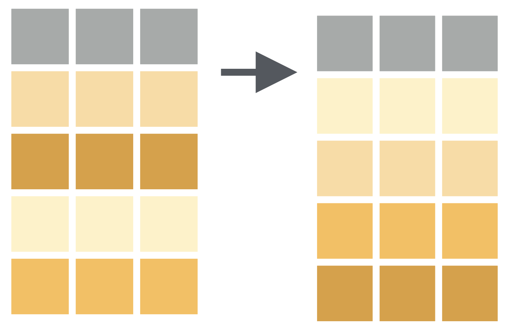

```{r setup, include=FALSE}
options(htmltools.dir.version = FALSE)
knitr::opts_chunk$set(collapse = TRUE,
                      fig.retina = 3,
                      echo = FALSE,
                      fig.align='center')
library(countdown)
library(ymlthis)
library(tidyverse)
library(ggthemes)
library(icons)
#library(icon)
library(xaringanExtra)
library(emoji)
library(palmerpenguins)
xaringanExtra::use_tachyons()
xaringanExtra::use_tile_view()
xaringanExtra::use_webcam()
xaringanExtra::use_fit_screen()
xaringanExtra::use_extra_styles(hover_code_line = TRUE, mute_unhighlighted_code = TRUE)
xaringanExtra::use_share_again()
xaringanExtra::use_panelset()
```

```{r meta, echo=FALSE}
library(metathis)
meta() %>%
  meta_general(
    description = "Ajay Koli - Aspiring Data Scientist",
    generator = "xaringan and remark.js"
  ) %>% 
  meta_name("github-repo" = "koliajaykr/r-training-vupune") %>% 
  meta_social(
    title = "R FOR BEGINNERS",
    url = "https://r4b-vu.netlify.app/",
    image = "https://r4b-vu.netlify.app/images/social-card.png",
    og_type = "talk",
    og_author = "Ajay Koli",
    twitter_card_type = "summary_large_image",
    twitter_creator = "@ajay_kolii"
  ) %>%
  include_meta()
```

name: module4

class: title-slide, right, middle, hide-count, hide-logo

background-image: url("https://images.unsplash.com/photo-1591903934817-c02acbfd4665?ixlib=rb-1.2.1&ixid=MnwxMjA3fDB8MHxwaG90by1wYWdlfHx8fGVufDB8fHx8&auto=format&fit=crop&w=1932&q=80")
background-size: cover

<br>
<br>
<br>
<br>

# .black.big-text[Data<br>Wrangling]
## .black[Session - 4]

.footnote[
.white[Image credits:][Karina L](https://unsplash.com/photos/zJRQ5nngdPA)
]

---

class: center

# Course Progress

```{r echo=FALSE, out.width="100%"}
knitr::include_graphics("images/data-science-wrangle.png")
```

---

# What is Data wrangling?

--

- "data exploration and data manipulation" [(Jesse Mostipak)](https://www.kaggle.com/jessemostipak/dive-into-dplyr-tutorial-1)

--

- "tidying and transforming" [(Hadley & Garrett)](https://r4ds.had.co.nz/index.html)

--

```{r echo=FALSE, out.width="100%"}
knitr::include_graphics("images/tidy-1.png")
```

---

# "Transforming" data means:

- "narrowing in on observations of interest ... 

--

- creating new variables that are functions of existing variables ... and

--

- calculating a set of summary statistics." 

.footnote[[Source](https://r4ds.had.co.nz/index.html)]

---

class: hide-count, middle, hide-logo
background-image: url(images/dplyr.svg)
background-size: contain
background-position: right

# .big-text[R<br>Package]

---

# `dplyr` package

- "dplyr is a grammar of data manipulation"

--

- "providing a consistent set of verbs that help you solve the most common data manipulation challenges:"

--

- Few important functions:
  - `filter()` 
  - `select()` 
  - `mutate()` 
  - `arrange()` 
  - `summarise()`

.footnote[
[Source](https://dplyr.tidyverse.org/)
]

---

# `filter()` function: 

- Picks cases based on their values.

```{r filter-img, echo=FALSE, fig.align='center', out.width="65%"}
knitr::include_graphics("images/01-filter.png")
```

---

class: center, middle 

# How to have a data of only Gentoo penguins?

---

.panelset[

.panel[.panel-name[Codes]

```{r filter-fun, eval=FALSE, echo=TRUE}
# there are three species: Chinstrap, Gentoo, Adelie
penguins %>% 
  filter(species == "Gentoo") #<<
```
]

.panel[.panel-name[Output]

```{r ref.label="filter-fun", echo=FALSE, message=FALSE}

```

]
]

---

.panelset[

.panel[.panel-name[Codes]

```{r filter-summ, eval=FALSE, echo=TRUE}
# there are three species: Chinstrap, Gentoo, Adelie

praw <- read_csv("data/gentoo-penguins1.csv")

praw %>% 
  filter(species == "Gentoo") %>% 
  summary() %>% 
  kableExtra::kable()
```
]

.panel[.panel-name[Output]

```{r ref.label="filter-summ", echo=FALSE, message=FALSE}

```

]
]

---

class: center, middle

# How to export data file to your computer?

---

.panelset[

.panel[.panel-name[Codes]

```{r filter-fun1, eval=FALSE, echo=TRUE}
# three species are Chinstrap, Gentoo, Adelie
penguins %>% 
  filter(species == "Gentoo") %>% 
  write_csv("data/gentoo-penguins.csv") #<<

```
]

.panel[.panel-name[Output]

```{r ref.label="filter-fun1", echo=FALSE, message=FALSE}

```

]
]

---

# `r emo::ji("raised_hand")` WAIT! What is `%>% `

--

- this is called **pipe** ( `%>%` = control + shift + m)

--

- "a powerful tool for clearly expressing a sequence of **multiple operations**"

--

- interpret/read it as **then**.

```{r echo=T, eval=FALSE}
penguins %>% 
  filter(species == "Gentoo") %>% 
  summary() %>% 
  kableExtra::kable()
```

---

# Comparison: Relational Operators

`x < y`

--

`x > y`

--

`x <= y`

--

`x >= y`

--

`x == y` (equal)

--

`x != y` (not equal)

---
class: center, middle 

# How to have a data of penguins with bill length more than 43 mm?

---

.panelset[

.panel[.panel-name[Codes]

```{r filter-fun2, eval=FALSE, echo=TRUE}
penguins %>% 
  filter(bill_length_mm > 43) 
```
]

.panel[.panel-name[Output]

```{r ref.label="filter-fun2", echo=FALSE, message=FALSE}

```

]
]

---
class: center, middle 

# How to have a data of Gentoo penguins with bill length more than 55 mm?

---
.panelset[

.panel[.panel-name[Codes]

```{r filter-fun3, eval=FALSE, echo=TRUE}
penguins %>% 
  filter(species == "Gentoo",
         bill_length_mm > 55)
```
]

.panel[.panel-name[Output]

```{r ref.label="filter-fun3", echo=FALSE, message=FALSE}

```

]
]

---
class: center, middle 

# How to have data of non-Gentoo penguins with bill length more than 45 mm and weight more than 4 kg?

---

.panelset[

.panel[.panel-name[Codes]

```{r filter-fun4, eval=FALSE, echo=TRUE}
penguins %>% 
  filter(species != "Gentoo",
         bill_length_mm > 45,
         body_mass_g > 4000)
```
]

.panel[.panel-name[Output]

```{r ref.label="filter-fun4", echo=FALSE, message=FALSE}

```

]
]

---
class: center, middle

# How to have only top or bottom rows from data?

---

.panelset[

.panel[.panel-name[Codes]

```{r filter-fun41, eval=FALSE, echo=TRUE}
penguins %>% 
  filter(species != "Gentoo",
         bill_length_mm > 45,
         body_mass_g > 4000) %>% 
  head() #<<
```
]

.panel[.panel-name[Output]

```{r ref.label="filter-fun41", echo=FALSE, message=FALSE}

```

]
]

---

.panelset[

.panel[.panel-name[Codes]

```{r filter-fun42, eval=FALSE, echo=TRUE}
penguins %>% 
  filter(species != "Gentoo",
         bill_length_mm > 45,
         body_mass_g > 4000) %>% 
  tail(3) #<<
```
]

.panel[.panel-name[Output]

```{r ref.label="filter-fun42", echo=FALSE, message=FALSE}

```

]
]

---

class: your-turn, hide-logo

# `r emo::ji("brain")` YOUR TURN


```{r echo=FALSE}
countdown(minutes = 10, top = 0, font_size = "3em")
```

.panelset[

.panel[.panel-name[Task]

How many Chinstrap penguins are with bill length more than 45 mm and weight more than 4 kg?
]

.panel[.panel-name[Codes]

```{r yt1, eval=FALSE, echo=TRUE}
penguins %>% 
  filter(species == "Chinstrap",
         bill_length_mm > 45,
         body_mass_g > 4000) %>% 
  head()
```

]

.panel[.panel-name[Output]

```{r ref.label="yt1", echo=FALSE, message=FALSE}

```

]
]

---

# `select()` function: Chooses rows based on column values.

```{r select-img, echo=FALSE, fig.align='center', out.width="60%"}
knitr::include_graphics("images/03-select.png")
```

---
class: center, middle

# How to have only `species` variable in data?

---

.panelset[

.panel[.panel-name[Codes]

```{r col-fun1, eval=FALSE, echo=TRUE}
penguins %>% 
  select(species) #<<
```
]

.panel[.panel-name[Output]

```{r ref.label="col-fun1", echo=FALSE, message=FALSE}

```

]
]

---
class: center, middle

# How to have a specific range of variables in data?

---

.panelset[

.panel[.panel-name[Codes]

```{r col-fun2, eval=FALSE, echo=TRUE}
penguins %>% 
  select(species : bill_depth_mm)
```
]

.panel[.panel-name[Output]

```{r ref.label="col-fun2", echo=FALSE, message=FALSE}

```

]
]

---
class: center, middle

# How to have variables based upon their location in data?

---

.panelset[

.panel[.panel-name[Codes]

```{r col-fun3, eval=FALSE, echo=TRUE}
penguins %>% 
  select(4:8)
```
]

.panel[.panel-name[Output]

```{r ref.label="col-fun3", echo=FALSE, message=FALSE}

```

]
]

---
class: center, middle

# How to have specific variables in data?

---

.panelset[

.panel[.panel-name[Codes]

```{r col-fun4, eval=FALSE, echo=TRUE}
penguins %>% 
  select(species, body_mass_g, year)
```
]

.panel[.panel-name[Output]

```{r ref.label="col-fun4", echo=FALSE, message=FALSE}

```

]
]

---

.panelset[

.panel[.panel-name[Codes]

```{r col-fun5, eval=FALSE, echo=TRUE}
penguins %>% 
  select(-c(species, body_mass_g, year))
```
]

.panel[.panel-name[Output]

```{r ref.label="col-fun5", echo=FALSE, message=FALSE}

```

]
]

---

# `mutate()` function: Adds new variables that are functions of existing variables

```{r mutate-img, echo=FALSE, fig.align='center', out.width="75%"}
knitr::include_graphics("images/04-mutate.png")
```

---

class: center, middle

# How to convert penguin body mass from grams to kilograms?

---

.panelset[

.panel[.panel-name[Codes]

```{r col-fun7, eval=FALSE, echo=TRUE}
penguins %>% 
  mutate(body_mass_kg = body_mass_g / 1000) #<<
```
]

.panel[.panel-name[Output]

```{r ref.label="col-fun7", echo=FALSE, message=FALSE}

```

]
]

---

.panelset[

.panel[.panel-name[Codes]

```{r col-fun77, eval=FALSE, echo=TRUE}
penguins %>% 
  select(body_mass_g) %>%
  mutate(body_mass_kg = body_mass_g / 1000)
```
]

.panel[.panel-name[Output]

```{r ref.label="col-fun77", echo=FALSE, message=FALSE}

```

]
]

---

.panelset[

.panel[.panel-name[Codes]

```{r col-fun8, eval=FALSE, echo=TRUE}
penguins %>% 
  mutate(body_mass_kg = body_mass_g / 1000, 
         bill = bill_length_mm * bill_depth_mm)
```
]

.panel[.panel-name[Output]

```{r ref.label="col-fun8", echo=FALSE, message=FALSE}

```

]
]

---

.panelset[

.panel[.panel-name[Codes]

```{r col-fun81, eval=FALSE, echo=TRUE}
penguins %>% 
  mutate(body_mass_kg = body_mass_g / 1000,
         bill = bill_length_mm * bill_depth_mm) %>% 
  select(body_mass_kg,
         bill)
```
]

.panel[.panel-name[Output]

```{r ref.label="col-fun81", echo=FALSE, message=FALSE}

```

]
]

---

# `arrange()` function: Changes the order of the rows.

```{r arrange-img, echo=FALSE, fig.align='center', out.width="65%"}

```

---

class: center, middle

# How to have data arranged by the ascending order of bill length of penguins?

---

.panelset[

.panel[.panel-name[Codes]

```{r arg-fun, eval=FALSE, echo=TRUE}
penguins %>% 
  arrange(bill_length_mm) #<<
```
]

.panel[.panel-name[Output]

```{r ref.label="arg-fun", echo=FALSE, message=FALSE}

```

]
]

---

.panelset[

.panel[.panel-name[Codes]

```{r arg-fun2, eval=FALSE, echo=TRUE}
penguins %>% 
  arrange(desc(bill_length_mm)) #<<
```
]

.panel[.panel-name[Output]

```{r ref.label="arg-fun2", echo=FALSE, message=FALSE}

```

]
]

---

.panelset[

.panel[.panel-name[Codes]

```{r arg-fun3, eval=FALSE, echo=TRUE}
penguins %>% 
  arrange(species)
```
]

.panel[.panel-name[Output]

```{r ref.label="arg-fun3", echo=FALSE, message=FALSE}

```

]
]

---

class: center, middle, inverse

# `summarise()` function

---

# `summarise()` function: Chooses rows based on column values.

```{r summ-img, echo=FALSE, fig.align='center', out.width="75%"}
knitr::include_graphics("images/05-summarise.png")
```

---

class: center, middle

# How to find mean bill length of all penguins?

---

.panelset[

.panel[.panel-name[Codes]

```{r summ-fun1, eval=FALSE, echo=TRUE}
penguins %>% 
  drop_na() %>% #<<
  summarise(mean_bill_length_mm = mean(bill_length_mm)) #<<
```
]

.panel[.panel-name[Output]

```{r ref.label="summ-fun1", echo=FALSE, message=FALSE}

```

]
]

---

class: center, middle

# How to find species-wise mean bill length of penguins?

---

.panelset[

.panel[.panel-name[Codes]

```{r summ-fun2, eval=FALSE, echo=TRUE}
penguins %>% 
  drop_na() %>% #<<
  group_by(species) %>% #<<
  summarise(mean_bill_length_mm = mean(bill_length_mm))
```
]

.panel[.panel-name[Output]

```{r ref.label="summ-fun2", echo=FALSE, message=FALSE}

```

]
]

---

class: center, middle

# How to find species-wise mean bill length of penguins and total number of penguins in each species?

---

.panelset[

.panel[.panel-name[Codes]

```{r summ-fun21, eval=FALSE, echo=TRUE}
penguins %>% 
  drop_na() %>% 
  group_by(species) %>% 
  summarise(mean_bill_length_mm = mean(bill_length_mm), n = n()) #<<
```
]

.panel[.panel-name[Output]

```{r ref.label="summ-fun21", echo=FALSE, message=FALSE}

```

]
]

---

class: center middle hide-count

#  `r emo::ji("woman_raising_hand_medium_skin_tone")``r emo::ji("man_raising_hand")`<br>.big-text[Q&A]
