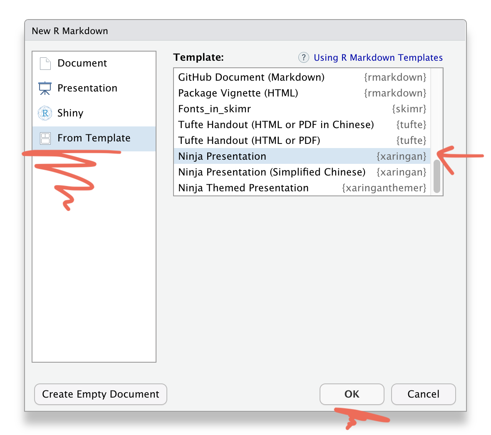
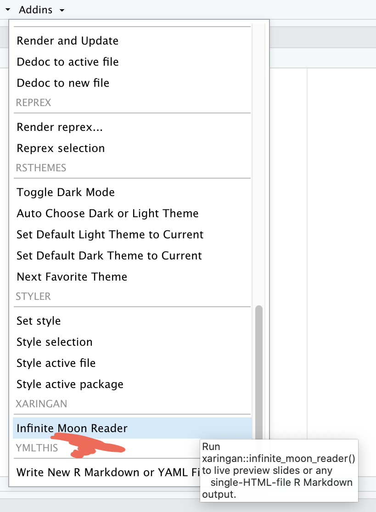

```{r setup, include=FALSE}
options(htmltools.dir.version = FALSE)
knitr::opts_chunk$set(collapse = TRUE,
                      fig.retina = 3,
                      echo = FALSE,
                      fig.align='center')
library(countdown)
library(ymlthis)
library(tidyverse)
library(ggthemes)
library(icons)
#library(icon)
library(xaringanExtra)
library(emoji)
library(palmerpenguins)
xaringanExtra::use_tachyons()
xaringanExtra::use_tile_view()
xaringanExtra::use_webcam()
xaringanExtra::use_fit_screen()
xaringanExtra::use_extra_styles(hover_code_line = TRUE, mute_unhighlighted_code = TRUE)
xaringanExtra::use_share_again()
xaringanExtra::use_panelset()
```

```{r meta, echo=FALSE}
library(metathis)
meta() %>%
  meta_general(
    description = "Ajay Koli - Aspiring Data Scientist",
    generator = "xaringan and remark.js"
  ) %>% 
  meta_name("github-repo" = "koliajaykr/r-training-vupune") %>% 
  meta_social(
    title = "R FOR BEGINNERS",
    url = "https://r4b-vu.netlify.app/",
    image = "https://r4b-vu.netlify.app/images/social-card.png",
    og_type = "talk",
    og_author = "Ajay Koli",
    twitter_card_type = "summary_large_image",
    twitter_creator = "@ajay_kolii"
  ) %>%
  include_meta()
```

name: module5

class: title-slide, left, middle, hide-count, hide-logo

background-image: url("https://images.unsplash.com/photo-1638366271870-8b3d428f27f8?ixlib=rb-1.2.1&ixid=MnwxMjA3fDB8MHxwaG90by1wYWdlfHx8fGVufDB8fHx8&auto=format&fit=crop&w=1771&q=80")
background-size: cover

# .black.big-text[Slide<br>Crafting]
## .black[Session - 5]

.footnote[
.white[Image credits:][Markus Spiske](https://images.unsplash.com/photo-1638366271870-8b3d428f27f8?ixlib=rb-1.2.1&ixid=MnwxMjA3fDB8MHxwaG90by1wYWdlfHx8fGVufDB8fHx8&auto=format&fit=crop&w=1742&q=80)
]

---

class: hide-count, middle, hide-logo

background-image: url(images/xaringan-logo.png)
background-size: contain
background-position: right 

# .big-text[R<br>Package]

---

# xaringan

- xaringan package to be a Presentation Ninja `r emo::ji("sword")`

--

- "for creating slideshows with remark.js through R Markdown"

--

- [Xie Yihui](https://yihui.org/en/)

```{r hadley2, echo=FALSE, out.width="42%", fig.align='center'}
knitr::include_graphics("https://usesthis.com/images/interviews/yihui.xie/portrait.jpg")
```

.footnote[
[Source](https://github.com/yihui/xaringan)
]

---

# Packages required: 

```{r pkgs2, echo=TRUE}
library(palmerpenguins) # to access penguin data

library(xaringan)
library(xaringanthemer)
library(xaringanExtra)
```

---
class: center

# File $\longrightarrow$ New File $\longrightarrow$ R Markdown

```{r out.width="75%"}
knitr::include_graphics("images/rmd-new.png")
```


---
class: center

# Template $\rightarrow$ Ninja Presentation

```{r out.width="55%"}

```

---
class: center

# Save this Rmd file

```{r out.width="50%"}
knitr::include_graphics("images/xar2.png")
```

---
class: center

.pull-left[
### Addins $\rightarrow$ Inifinite Moon Reader

```{r out.width="65%"}

```
]

--

.pull-right[

### xaringan output 

```{r }
knitr::include_graphics("images/xar4.png")
```
]

---
class: center

.pull-left[
### Addins $\rightarrow$ Inifinite Moon Reader

```{r out.width="65%"}

```
]

.pull-right[

### xaringan slide $\rightarrow$ browser 

```{r }
knitr::include_graphics("images/xar5-browser.png")
```
]

--

- We need to click `Inifinite Moon Reader` only to start the slideshow. To see the changes made in the slides just save the document `ctrl + s`

---

# Using xaringan how to:

--

1. create a new slide

--

1. hide an existing slide

--

1. heading, subheadings, points and normal text

--

1. include images

--
    - as background
--
    - as part of slide
--

1. make plots

--

1. include tables

--

1. in-text R output

--

1. create columns

---

1. Use `---` to create a new slide

--

1. `exclude:true` To hide an existing slide

--

1. Slide text sizes:

--

  - `#` for main heading

--

  - `##` for sub-heading

--

  - `####` for sub-sub-heading

--

  * indented `*` for sub-point1
  * indented `*` for sub-point2
  * indented `*` for sub-point3

--

- `-` for normal text size

---

# To include images using:

###  CSS `background` option:

--

- `background-image: url("path of the image")` = path of the image

--

- `background-size: contain, cover, 50%, 70%` = size of the image

--

- `background-position: left top` = position of the image

---

# To include images using:

###  `knitr` chunk option:

```{r eval=FALSE, echo=TRUE, out.width="45%", fig.align="center"}
knitr::include_graphics("path of the image")
```

---

# To include plots

```{r eval=FALSE, echo=TRUE}
library(palmerpenguins)
ggplot(penguins, aes(x = species)) +
  geom_bar()
```

---

# To include tables

```{r message=FALSE, echo=TRUE}
library(kableExtra)
library(tidyverse)

penguins %>% 
  drop_na() %>% 
  head() %>% 
  kable() 

```

---

# In-text R output

- penguins data have a sample of $n$ = `r nrow(penguins)` on total `r ncol(penguins)` variables.

--

- math expressions 

$a + b = \sigma - \sum{x}_2^2$

---

# Column division of slide


.pull-left[
##- left column

- a

  - b
  - c
]

.pull-right[
##- right column

- apple
- boy
- cat
]

---

# Slide `class`

- class can be assigned to each slide

--

- it decides how all elements of one particular slide will look like

---
class: center

# Slide `class`

- class can be assigned to each slide

- it decides how all elements of one particular slide will look like

- `class: center`

---

class: center, middle, inverse, right

# Slide `class`

- class can be assigned to each slide

- it decides how all elements of one particular slide will look like

- `class: center, middle, inverse, right`

---

# Extend the power of xaringan:

--

- using R packages like [xaringanExtra](https://pkg.garrickadenbuie.com/xaringanExtra/#/README?id=xaringanextra)

--

- learn little about [CSS](https://www.w3schools.com/css/)

--

- use [cheatsheets](https://rstudio.com/resources/cheatsheets/)

---

class: hide-logo, hide-count, middle

background-image: url("images/giphy.gif")
background-position: 10%
background-color: #353935
background-size: 35%


.pull-right[
# .center.white[Congratulations!!! <br><br>`r emo::ji("tada")` `r emo::ji("partying_face")` `r emo::ji("confetti_ball")`<br><br>Thank you]
]
