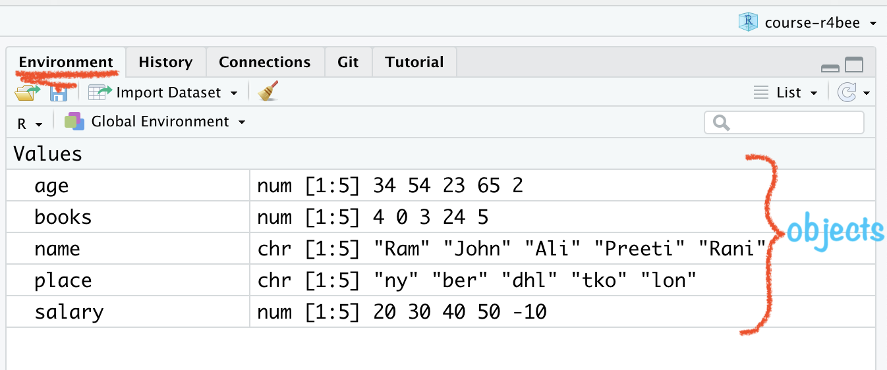

```{r setup, include=FALSE}
options(htmltools.dir.version = FALSE)
knitr::opts_chunk$set(
  collapse = TRUE,
  fig.retina = 3,
  comment = ""
)
library(ymlthis)
library(countdown)
library(tidyverse)
library(magick)
library(icon)
library(xaringanExtra)
xaringanExtra::use_tachyons()
```

layout: true

<a class="footer-link" href="https://r4b.netlify.app/">r4b/share</a>

```{css side-hie, echo=FALSE}
# codes to hide specific slide number
.hide-count .remark-slide-number {
  display: none;
}
```

---

class: title-slide, center, bottom
background-image: url(images/01-basics/featured.jpg)
background-size: 58%
background-position: 50% 0%


# `r rmarkdown::metadata$title`

## .orange[`r rmarkdown::metadata$subtitle`]

### `r rmarkdown::metadata$author`

---

class: center

background-image: url("images/01-basics/rstd-proj.png")
background-size: 70%
background-position: center bottom

# Open RStudio

---

class: center

background-image: url("images/01-basics/rstd-proj-none.png")
background-size: 70%
background-position: center bottom

# Open RStudio

---

class: center

background-image: url("images/01-basics/rstd-proj-folders.png")
background-size: 70%
background-position: center bottom

# Open RStudio

---

class: inverse, center, middle

# .big-text[RStudio Project 🗂]

---

class: center
background-image: url("images/01-basics/r-projects.jpg")
background-size: 70%
background-position: 50% 80%

# Using RStudio Project

.footnote[
Img: [Allison Horst](https://www.allisonhorst.com/)
]

---

background-image: url("images/01-basics/project-logo.png")
background-size: 30%
background-position: right center

# Using RStudio Projects

- "to divide your work into multiple contexts, each with their own:         

--

  - working directory, 
  
--
  
  - workspace, 
  
--
  
  - history, and 
  
--
  
  - source documents."

.footnote[

Source: [RStudio Support](https://support.rstudio.com/hc/en-us/articles/200526207-Using-Projects) 

]

---
class: center, middle

# Create R Project in 4 Steps:

```{r echo=FALSE}
knitr::include_graphics("images/01-basics/rstd-proj-1.png")
```

---
class: center, middle

# Create R Project in 4 Steps:

```{r echo=FALSE}
knitr::include_graphics("images/01-basics/rstd-proj-2.png")
```

---
class: center, middle

# Create R Project in 4 Steps:

```{r echo=FALSE}
knitr::include_graphics("images/01-basics/rstd-proj-3.png")
```

---
class: center, middle

# Create R Project in 4 Steps:

```{r echo=FALSE}
knitr::include_graphics("images/01-basics/rstd-proj-4.png")
```

---

class: center

background-image: url("images/01-basics/rstd-project-open.png")
background-size: 70%
background-position: center bottom

# Open RStudio Project

---

class: center

background-image: url("images/01-basics/rstd-project-open1.png")
background-size: 70%
background-position: center bottom

# Open RStudio Project

---

class: center

background-image: url("images/01-basics/rstd-project-open2.png")
background-size: 70%
background-position: center bottom

# Open RStudio Project

---

class: inverse, center, middle

# .big-text[R Script 📜]

---

class: center

background-image: url("images/01-basics/script-new.png")
background-size: 70%
background-position: center bottom

# File $\rightarrow$ New File $\rightarrow$ R Script

---

class: center

background-image: url("images/01-basics/script-saved.png")
background-size: 70%
background-position: center bottom

# Saved R Script

---

class: center

background-image: url("images/01-basics/script-to-console1.png")
background-size: 70%
background-position: center bottom

# Script file for writing the codes 

---

class: center

background-image: url("images/01-basics/script-to-console2.png")
background-size: 70%
background-position: center bottom

# Console to process the codes 

---

class: center

background-image: url("images/01-basics/script-to-console3.png")
background-size: 70%
background-position: center bottom

# R **Script** is processed in **Console**

---

class: center

background-image: url("images/01-basics/script-to-console4.png")
background-size: 70%
background-position: center bottom

# R **Script** is processed in **Console**

---

# How to run R script in console? 🤔

--

##- To run the current line or selection: `ctrl + enter`

--

##- To run the active document script: `ctrl + shift + enter`  

---

class: live-code

.pull-left[

# .center[R Script]

```{r calci1, eval=FALSE, echo=TRUE}
1 #<<
```

]

.pull-right[

# .center[Console ]

```{r ref.label="calci1", echo=FALSE}

```

]

---

class: live-code

.pull-left[

# .center[R Script]

```{r calci2, eval=FALSE, echo=TRUE}
1

1 + 1 #<<
```

]

.pull-right[

# .center[Console ]

```{r ref.label="calci2", echo=FALSE}

```

]

---

class: live-code

.pull-left[

# .center[R Script]

```{r calci3, eval=FALSE, echo=TRUE}
1

1 + 1

34 - 40 #<<
```

]

.pull-right[

# .center[Console ]

```{r ref.label="calci3", echo=FALSE}

```

]

---

class: live-code

.pull-left[

# .center[R Script]

```{r calci4, eval=FALSE, echo=TRUE}
1

1 + 1

34 - 40

5 * 4 #<<
```

]

.pull-right[

# .center[Console ]

```{r ref.label="calci4", echo=FALSE}

```

]

---

class: live-code

.pull-left[

# .center[R Script]

```{r calci5, eval=FALSE, echo=TRUE}
1

1 + 1

34 - 40

5 * 4

16 / 2 #<<
```

]

.pull-right[

# .center[Console ]

```{r ref.label="calci5", echo=FALSE}

```

]

---

class: live-code

.pull-left[

# .center[R Script]

```{r calci6, eval=FALSE, echo=TRUE}
1

1 + 1

34 - 40

5 * 4

16 / 2

0.2 + 0.8 #<<
```

]

.pull-right[

# .center[Console ]

```{r ref.label="calci6", echo=FALSE}

```

]

---

class: live-code

.pull-left[

# .center[R Script]

```{r calci7, eval=FALSE, echo=TRUE}
1

1 + 1

34 - 40

5 * 4

16 / 2

0.2 + 0.8

3 > 7 #<<

3 == 3 #<<

3 < 5 #<<
```

]

.pull-right[

# .center[Console ]

```{r ref.label="calci7", echo=FALSE}

```

]

---

class: your-turn, inverse

# 🤯 Your Turn

## 1. *ab ye kar ke dikhao* 🕺🏽💃🏼

---

class: inverse, center, middle

# .big-text[R Function🪅]


---

# R Function

- "A function, in a programming environment, is **a set of instructions**. A programmer builds a function to .b[avoid repeating the same task], or reduce complexity."

--

.pull-left[

## .center[R function]

```{r func1, eval=FALSE, echo=TRUE}
round(9.1565, 2)
```

]

--

.pull-right[

## .center[Console ]

```{r ref.label="func1", echo=FALSE}

```

]

---

class: center
background-image: url("images/01-basics/function.png")
background-size: 90%
background-position: 60% 70%

# Structure of R function

---
class: live-code
.pull-left[

# .center[R Script]

```{r func2, eval=FALSE, echo=TRUE}
round(
  x = 564.56743,
  digits = 2
)
```

]

.pull-right[

# .center[Console]

```{r ref.label="func2", echo=FALSE}

```

]

???

use tab key inside empty function bracket

---
class: live-code
.pull-left[

# .center[R Script]

```{r sqrt, eval=FALSE, echo=TRUE}
sqrt(
  x = 9
)
```

]

.pull-right[

# .center[Console]

```{r ref.label="sqrt", echo=FALSE}

```

]

---
class: live-code
.pull-left[

# .center[R Script]

```{r seq, eval=FALSE, echo=TRUE}
seq.int(
  from = 10,
  to = 30,
  by = 5
)
```

]

.pull-right[

# .center[Console]

```{r ref.label="seq", echo=FALSE}

```

]

---

# R Comment:

- "a comment is a programmer-readable explanation or annotation in the source code of a computer program." <sup>1</sup>

--

- "Humans will be able to read the comments, but your computer will pass over them."

--

- `#` is used as a commenting symbol

.footnote[
[1]. Source: [Wikipedia](https://en.wikipedia.org/wiki/Comment_(computer_programming)
]

---
class: live-code
.pull-left[

# .center[R Script]

```{r comment, eval=FALSE, echo=TRUE}
# hello world!

## is a comment

(1 + 4) - (3 * 5) / 10
```

]

.pull-right[

# .center[Console]

```{r ref.label="comment", echo=FALSE}

```

]

---

class: inverse, middle, right

background-image: url("images/01-basics/amelia.png"), url("images/01-basics/amelia2.jpg"), url("images/01-basics/amelia3.jpg"), url("images/01-basics/amelia4.jpg")
background-position: 0% 0%, 50% 0%, 0% 100%, 90% 0%
background-size: 25%, 30%, 22%, 20%

# .big-text[R Packages]


---

class: center

# Download R package

```{r echo=FALSE, out.width="60%"}
knitr::include_graphics("images/01-basics/pkg-download.png")
```

---

# Use R package

```{r pkg-use, echo=T}
library(tidyverse)
```

- To use R package write one time inside your script:  
`library(name of the package)`

---

class: live-code

.pull-left[

# .center[R Script]

```{r lib1, eval=FALSE, echo=TRUE}
library(tidyverse)
```

]

.pull-right[

# .center[Console ]

```{r ref.label="lib1", echo=FALSE}

```

]


---

class: inverse, center, middle

# .big-text[R Objects 🎈]

---

# R Object

## "Just a name that you can use to call up stored data"

.footnote[
Source: https://rstudio-education.github.io/hopr/basics.html
]

---

# Guideline to name `objects` in R:

  - a name cannot start with a number  
  
--

  - a name cannot use some special symbols, like ^, !, $, @, +, -, /, or *:  
  
--

  - avoid caps  
  
--

  - avoid space  
--

  - use dash (like na-me) or underscore (like na_me)  
  
--

  - if chronology matters then add date (2020-09-05-file-name)

---

class: live-code

.pull-left[

# .center[R Script]

```{r obj1, eval=FALSE, echo=TRUE}

salary <- c(20, 30, 40, 50, -10) #<<

salary
```

]

.pull-right[

# .center[Console ]

```{r ref.label="obj1", echo=FALSE}

```

]

---

class: live-code

.pull-left[

# .center[R Script]

```{r obj2, eval=FALSE, echo=TRUE}

name <- c(
  "Ram",
  "John",
  "Ali",
  "Preeti",
  "Rani"
)

name
```

]

.pull-right[

# .center[Console ]

```{r ref.label="obj2", echo=FALSE}

```

]

---

class: live-code

.pull-left[

# .center[R Script]

```{r obj3, eval=FALSE, echo=TRUE}
# names of created objects
objects() #<<
```

]

.pull-right[

# .center[Console ]

```{r ref.label="obj3", echo=FALSE}

```

]

---

class: live-code

.pull-left[

# .center[R Script]

```{r obj4, eval=FALSE, echo=TRUE}

age <- c(
  34,
  54,
  23,
  65,
  2
)

age
```

]

.pull-right[

# .center[Console ]

```{r ref.label="obj4", echo=FALSE}

```

]

---

class: live-code

.pull-left[

# .center[R Script]

```{r obj5, eval=FALSE, echo=TRUE}

place <- c(
  "ny",
  "ber",
  "dhl",
  "tko",
  "lon"
)

place
```

]

.pull-right[

# .center[Console ]

```{r ref.label="obj5", echo=FALSE}

```

]

---

class: live-code

.pull-left[

# .center[R Script]

```{r obj6, eval=FALSE, echo=TRUE}

books <- c(4, 0, 3, 24, 5)

books
```

]

.pull-right[

# .center[Console ]

```{r ref.label="obj6", echo=FALSE}

```

]

---

class: center

# RStudio Environment Window

```{r echo=FALSE, out.width="70%"}

```

---

class: center

# to be tidy, our data should look like 👇

```{r, echo=FALSE}
soc <- data.frame(
  age,
  books,
  name,
  place,
  salary
)

soc
```

---

class: center

# R understands 'tidy' 🛀 Data

```{r echo=FALSE, out.width="100%"}
knitr::include_graphics("images/01-basics/tidy-1.png")
```

.footnote[
Source: [Book of Hadley & Grolemund](https://r4ds.had.co.nz/index.html)
]

---

class: live-code

.pull-left[
# R Script

```{r df1, eval=FALSE}
objects()
```

```{r df2, eval=FALSE}
soc <- data.frame( #<<
  age,
  books,
  name,
  place,
  salary
)

soc
```


]

.pull-right[
# Console

```{r ref.label="df1", echo=FALSE}

```

```{r ref.label="df2", echo=FALSE}

```

]

---

class: your-turn, hide-count

# Your turn 🏋🏽‍♂️ 

```{r echo=FALSE}
countdown(minutes = 10, top = 0, font_size = "3em")
```

## .gold[Write codes to prepare this data + add a new variable of your choice:]

```{r echo=FALSE}
state <- c("Germany", "France", "India", "Russia", "USA", "New Zealand")

pop <- c(20, 19, 50, 25, 30, 5)

capital <- c("Berlin", "Paris", "Delhi", "Moscow", "Washington", "Wellington")

foundation <- c("1870-12-10", "1789-07-14", "1947-08-15", "1990-06-12", "1776-07-04", "1840-02-06")

world <- data.frame(state, pop, capital, foundation)

world
```

