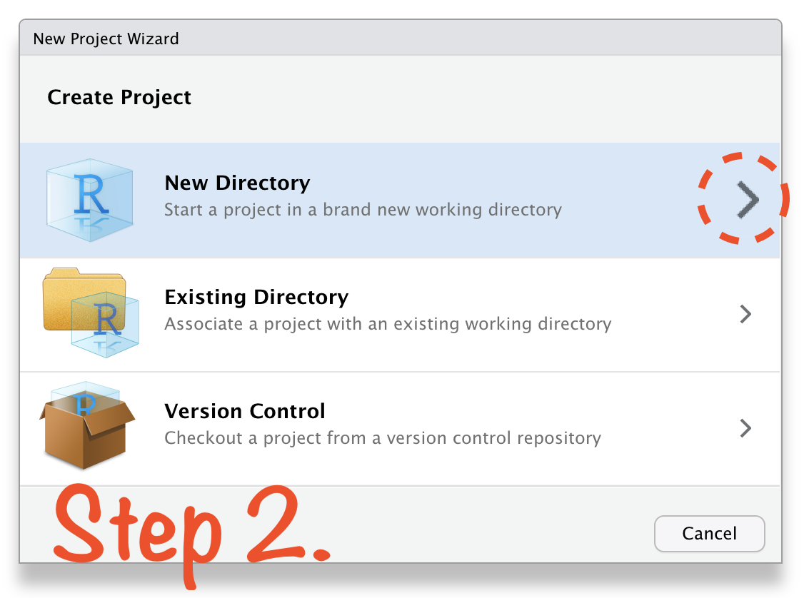
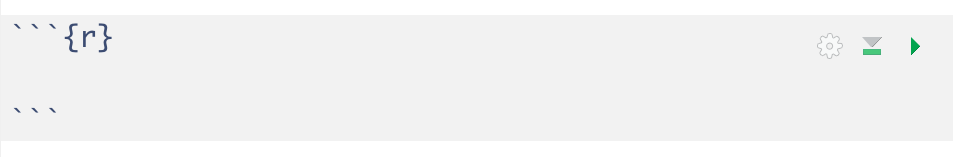

```{r setup, include=FALSE}
options(htmltools.dir.version = FALSE)
knitr::opts_chunk$set(
  collapse = TRUE,
  fig.retina = 3,
  comment = ""
)
library(ymlthis)
library(countdown)
library(tidyverse)
library(magick)
library(icon)
library(xaringanExtra)
xaringanExtra::use_tachyons()
xaringanExtra::use_tile_view()
xaringanExtra::use_webcam()
xaringanExtra::use_fit_screen()
xaringanExtra::use_extra_styles(hover_code_line = TRUE, mute_unhighlighted_code = TRUE)
xaringanExtra::use_share_again()
```

layout: true

---

class: title-slide, hide-count, bottom
background-image: url(images/01-basics/cover.jpg)
background-size: cover

.left-column[

# .b--dark-white.ba.ph4.bw3.center.b.white[The Basics <br>of R]
]

<br><br><br><br><br><br><br><br><br><br><br><br><br><br><br><br><br><br>

### .b.right.orange[`r rmarkdown::metadata$subtitle` <br> `r rmarkdown::metadata$author`]

---

class: center

```{r meta, echo=FALSE}
library(metathis)
meta() %>%
  meta_general(
    description = "RStudio projects, R scripts, functions, comments, packages & R objects",
    generator = "xaringan and remark.js"
  ) %>% 
  meta_name("github-repo" = "koliajaykr/course-r4bee") %>% 
  meta_social(
    title = "Getting started: The Basics of R",
    url = "https://r4b.netlify.app/slides/01-r-basics.html#1",
    image = "https://r4b.netlify.app/slides/images/01-basics/01-card.jpg",
    og_type = "website",
    og_author = "Ajay Koli",
    twitter_card_type = "summary_large_image",
    twitter_creator = "@koliajaykr"
  )
```


background-image: url("images/01-basics/rstd-proj.png")
background-size: 70%
background-position: center bottom

# Open RStudio

---

class: center

background-image: url("images/01-basics/rstd-proj-none.png")
background-size: 70%
background-position: center bottom

# Open RStudio

---

class: center

background-image: url("images/01-basics/rstd-proj-folders.png")
background-size: 70%
background-position: center bottom

# Open RStudio

---

class: inverse, hide-count
background-image: url("images/01-basics/project-logo.png")
background-size: 30%
background-position: 10%

<br>
.right-column[
# .center.big-text[RStudio Project]
]

---

background-image: url("images/01-basics/r-projects.jpg")
background-size: 65%
background-position: 100% 80%

# About RStudio Projects

- "to divide your work into multiple contexts, each with their own:         

--

  - working directory, 
  
--
  
  - workspace, 
  
--
  
  - history, and 
  
--
  
  - source documents."

.footnote[

Source: [RStudio Support](https://support.rstudio.com/hc/en-us/articles/200526207-Using-Projects); Img: [Allison Horst](https://www.allisonhorst.com/) 

]

---
class: center, middle

# Create R Project in 4 Steps:

```{r echo=FALSE}
knitr::include_graphics("images/01-basics/rstd-proj-1.png")
```

---
class: center, middle

# Create R Project in 4 Steps:

```{r echo=FALSE}

```

---
class: center, middle

# Create R Project in 4 Steps:

```{r echo=FALSE}
knitr::include_graphics("images/01-basics/rstd-proj-3.png")
```

---
class: center, middle

# Create R Project in 4 Steps:

```{r echo=FALSE}
knitr::include_graphics("images/01-basics/rstd-proj-4.png")
```

---

class: center

background-image: url("images/01-basics/rstd-project-name.png")
background-size: 70%
background-position: center bottom

# Open RStudio Project

---

class: center

background-image: url("images/01-basics/rstd-project-path.png")
background-size: 70%
background-position: center bottom

# Open RStudio Project

---

class: center

background-image: url("images/01-basics/rstd-project-path2.png")
background-size: 70%
background-position: center bottom

# Open RStudio Project

---

class: inverse, hide-count, center, bottom
background-image: url("images/01-basics/logo-rmd.png")
background-size: 25%
background-position: 50% 20%

# .bottom.big-text[R Markdown]

---

class: center

background-image: url("images/01-basics/script-new.png")
background-size: 70%
background-position: center bottom

# File $\rightarrow$ New File $\rightarrow$ R Markdown

---

class: center

background-image: url("images/01-basics/script-options.png")
background-size: 65%
background-position: center bottom

# R Markdown

---

class: center

background-image: url("images/01-basics/script-options1.png")
background-size: 65%
background-position: center bottom

# R Markdown

---

class: center

background-image: url("images/01-basics/script-options2.png")
background-size: 65%
background-position: center bottom

# R Markdown

---

class: center

background-image: url("images/01-basics/script-options3.png")
background-size: 65%
background-position: center bottom

# R Markdown

---

class: center

background-image: url("images/01-basics/script-saved.png")
background-size: 70%
background-position: center bottom

# Saved R Script

---

exclude: true
class: center

background-image: url("images/01-basics/script-to-console1.png")
background-size: 70%
background-position: center bottom

# Script file for writing the codes 

---

exclude: true
class: center

background-image: url("images/01-basics/script-to-console2.png")
background-size: 70%
background-position: center bottom

# Console to process the codes 

---

exclude: true
class: center

background-image: url("images/01-basics/script-to-console3.png")
background-size: 70%
background-position: center bottom

# R Script $\rightarrow$ Console $\rightarrow$ Output

---

exclude: true
class: center

background-image: url("images/01-basics/script-to-console4.png")
background-size: 70%
background-position: center bottom

# R Script $\rightarrow$ Console $\rightarrow$ Output

---

# To get output of R Markdown file:

- Click the `Knit` button

```{r out.width="50%", echo=FALSE}
knitr::include_graphics("images/01-basics/knit.png")
```

--

- or use the keyboard shortcut `ctrl + shift + k`  

---

# Three important parts of R Markdown:

##- .purple[YAML]

##- .orange[Code chunk]

##- .blue[Text]

---

background-image: url("images/01-basics/temp-yaml.png")
background-size: cover
background-position: left

---

background-image: url("images/01-basics/temp-chunk.png")
background-size: cover
background-position: left

---

background-image: url("images/01-basics/temp-text.png")
background-size: cover
background-position: left

---

class: center, bottom, inverse, hide-count
background-image: url("images/01-basics/code_hero.gif")
background-size: 30%
background-position: 50% 15%

# .big-text[Code Chunk]

---

# Code Chunk

```{r echo=FALSE, out.width="75%"}

```

--

- To get a new code chunk use `Ctrl + Alt + i`

---

# Code Chunk: To modify the options

```{r echo=FALSE, out.width="75%"}

```

---

# Code Chunk: To run previous chunks

```{r echo=FALSE, out.width="75%"}

```

--

```{r echo=FALSE, out.width="75%"}

```


---

# Code Chunk: To run the current Chunk

```{r echo=FALSE, out.width="75%"}

```

---

# R as a big calculator

.pull-left[

## Code

```{r calci1, eval=FALSE, echo=TRUE}
1 #<<
```

]

.pull-right[

## Output

```{r ref.label="calci1", echo=FALSE}

```

]

---

# R as a big calculator

.pull-left[

## Code

```{r calci2, eval=FALSE, echo=TRUE}
1

1 + 1 #<<
```

]

.pull-right[

## Output

```{r ref.label="calci2", echo=FALSE}

```

]


---

# R as a big calculator

.pull-left[

## Code

```{r calci3, eval=FALSE, echo=TRUE}
1

1 + 1

34 / 40 #<<
```

]

.pull-right[

## Output

```{r ref.label="calci3", echo=FALSE}

```

]

---

# R as a big calculator

.pull-left[

## Code

```{r calci4, eval=FALSE, echo=TRUE}
1

1 + 1

34 / 40

5 < 4 #<<
```

]

.pull-right[

## Output

```{r ref.label="calci4", echo=FALSE}

```

]

---

# R as a big calculator

.pull-left[

## Code

```{r calci5, eval=FALSE, echo=TRUE}
1

1 + 1

34 / 40

5 < 4

16 == 16 #<<
```

]

.pull-right[

## Output

```{r ref.label="calci5", echo=FALSE}

```

]

---

# R as a big calculator

.pull-left[

## Code

```{r calci6, eval=FALSE, echo=TRUE}
1

1 + 1

34 / 40

5 < 4

16 == 16 

12 > 2 #<<
```

]

.pull-right[

## Output

```{r ref.label="calci6", echo=FALSE}

```

]

---

class: inverse, hide-count, center, bottom
background-image: url("images/01-basics/rainbowr.gif")
background-size: 50%
background-position: 50% 5%

# .bottom.big-text[Functions]

---

# R Function

- "A function, in a programming environment, is **a set of instructions**. A programmer builds a function to .b[avoid repeating the same task], or reduce complexity."

--

.pull-left[

## .center[R Script]

```{r func1, eval=FALSE, echo=TRUE}
round(9.1565, 2)
```

]

--

.pull-right[

## .center[Console ]

```{r ref.label="func1", echo=FALSE}

```

]

---

class: center
background-image: url("images/01-basics/function-args.png")
background-size: 90%
background-position: 60% 70%

# Structure of R function

---

# Round Function

.pull-left[

## Code

```{r func2, eval=FALSE, echo=TRUE}
round(
  x = 564.56743,
  digits = 2
)
```

]

.pull-right[

## Output

```{r ref.label="func2", echo=FALSE}

```

]

???

use tab key inside empty function bracket

---

# Square Root Function

.pull-left[

## Code

```{r sqrt, eval=FALSE, echo=TRUE}
sqrt(
  x = 9
)
```

]

.pull-right[

## Output

```{r ref.label="sqrt", echo=FALSE}

```

]

---

# Sequence Function

.pull-left[

## R Script

```{r seq, eval=FALSE, echo=TRUE}
seq.int(
  from = 10,
  to = 30,
  by = 5
)
```

]

.pull-right[

## Console

```{r ref.label="seq", echo=FALSE}

```

]

---

class: inverse, hide-count, center, bottom
background-image: url("images/01-basics/stormyr.gif")
background-size: 45%
background-position: 50% 5%

# .bottom.big-text[Comments]

---

# R Comment:

- "a comment is a programmer-readable explanation or annotation in the source code of a computer program." <sup>1</sup>

--

- "Humans will be able to read the comments, but your computer will pass over them."

--

- `#` is used as a commenting symbol

.footnote[
[1]. Source: [Wikipedia](https://en.wikipedia.org/wiki/Comment_(computer_programming)
]

---

# Add Comment

.pull-left[

## Code

```{r comment, eval=FALSE, echo=TRUE}
# hello world!

(1 + 4) - (3 * 5) / 10
```

]

.pull-right[

## Output

```{r ref.label="comment", echo=FALSE}

```

]

---

class: inverse, middle, right, hide-count

background-image: url("images/01-basics/amelia.png"), url("images/01-basics/amelia2.jpg"), url("images/01-basics/amelia3.jpg"), url("images/01-basics/amelia4.jpg"), url("images/00-welcome/tidyverse_celestial.png")
background-position: 0% 0%, 50% 0%, 0% 100%, 90% 0%, 50% 100%
background-size: 25%, 30%, 22%, 20%, 20%

# .big-text[R Packages]

---

class: center

# Download (Tools $\rightarrow$ Install Packages)

```{r echo=FALSE, out.width="100%"}

```

---

class: center

# Name of the R Package(s)

```{r echo=FALSE, out.width="60%"}
knitr::include_graphics("images/01-basics/pkg-download2.png")
```

---

# How to use R package?

```{r pkg-use, echo=T}
library(tidyverse)
```

- To use R package write one time `library(name of the package)` inside your R script.  

---

# Use R Package

.pull-left[

## Code

```{r lib1, eval=FALSE, echo=TRUE}
# this pkd is installed

library(tidyverse)
```

]

.pull-right[

## Output

```{r ref.label="lib1", echo=FALSE}

```

]

---

class: live-code

# Use R Package

.pull-left[

## Code

```{r lib21, eval=FALSE, echo=TRUE}
# this pkd is installed

library(tidyverse)
```

```{r lib22, eval=FALSE, echo=TRUE}
# this pkg is not installed

library(vcd)
```

]

.pull-right[

## Output

```{r ref.label="lib21", echo=FALSE}

```

```{r lib23, echo=T, eval=FALSE}
<packageNotFoundError in library(vcd): there is no package called 'vcd'>
```

]


---

class: inverse, hide-count, center, bottom
background-image: url("images/01-basics/heartyr.gif")
background-size: 50%
background-position: 50% 5%

# .bottom.big-text[Objects]

---

# R Object

## "Just a name that you can use to call up stored data"

.footnote[
Source: https://rstudio-education.github.io/hopr/basics.html
]

---

# 🚨Guidelines to name `objects` in R:

  - a name cannot start with a number  
  
--

  - a name cannot use some special symbols, like ^, !, $, @, +, -, /, or *:  
  
--

  - avoid caps  
  
--

  - avoid space  
--

  - use dash (like na-me) or underscore (like na_me)  
  
--

  - if chronology matters then add date (2020-09-05-file-name)

---

# Create Object

.pull-left[

## Code

```{r obj1, eval=FALSE, echo=TRUE}

salary <- c(20, 30, 40, 50, -10) #<<

salary
```

]

.pull-right[

## Output

```{r ref.label="obj1", echo=FALSE}

```

]

---

# Create Object

.pull-left[

## Code

```{r obj2, eval=FALSE, echo=TRUE}

name <- c(
  "Ram",
  "John",
  "Ali",
  "Preeti",
  "Rani"
)

name
```

]

.pull-right[

## Output

```{r ref.label="obj2", echo=FALSE}

```

]


---

# Create Object

.pull-left[

## Code

```{r obj4, eval=FALSE, echo=TRUE}

age <- c(
  34,
  54,
  23,
  65,
  2
)

age
```

]

.pull-right[

## Output

```{r ref.label="obj4", echo=FALSE}

```

]

---

# Create Object

.pull-left[

## Code

```{r obj5, eval=FALSE, echo=TRUE}

place <- c(
  "ny",
  "ber",
  "dhl",
  "tko",
  "lon"
)

place
```

]

.pull-right[

## Output

```{r ref.label="obj5", echo=FALSE}

```

]

---

# Create Object

.pull-left[

## Code

```{r obj6, eval=FALSE, echo=TRUE}

books <- c(4, 0, 3, 24, 5)

books
```

]

.pull-right[

## Output

```{r ref.label="obj6", echo=FALSE}

```

]

---

class: center

# RStudio Environment Window

```{r echo=FALSE, out.width="70%"}
knitr::include_graphics("images/01-basics/env-rstd.png")
```

--

## 🤷🏽‍♂️  * how to convert these<br> objects/ variables into a **tidy** data*

---

class: hide-count
background-image: url("images/01-basics/tidydata_7.jpg")
background-size: cover

---

class: hide-count
background-image: url("images/01-basics/tidydata_1_1.jpg")
background-size: contain

---

class: hide-count
background-image: url("images/01-basics/tidydata_1_2.jpg")
background-size: contain

---

class: hide-count
background-image: url("images/01-basics/tidydata_2_1.jpg")
background-size: contain

---

class: hide-count
background-image: url("images/01-basics/tidydata_2_2.jpg")
background-size: contain

---

class: center

# Tidy data should look like 👇

```{r, echo=FALSE}
soc <- data.frame(
  age,
  books,
  name,
  place,
  salary
)

soc
```

--

```{r echo=FALSE, out.width="70%"}
knitr::include_graphics("images/01-basics/tidy-1.png")
```

.footnote[
Source: [Book of Hadley & Grolemund](https://r4ds.had.co.nz/index.html)
]

---

# Create Data Object

.pull-left[

## Code

```{r df1, eval=FALSE}
soc <- data.frame( #<<
  age,
  books,
  name,
  place,
  salary
)

soc
```


]

.pull-right[

## Output

```{r ref.label="df1", echo=FALSE}

```

]

---

class: your-turn, hide-count

# Your turn 🏋🏽‍♂️ 

```{r echo=FALSE}
countdown(minutes = 10, top = 0, font_size = "3em")
```

## .yellow[Write codes to prepare this data + add a new variable of your choice:]

```{r echo=FALSE}
state <- c("Germany", "France", "India", "Russia", "USA", "New Zealand")

pop <- c(20, 19, 50, 25, 30, 5)

capital <- c("Berlin", "Paris", "Delhi", "Moscow", "Washington", "Wellington")

foundation <- c("1870-12-10", "1789-07-14", "1947-08-15", "1990-06-12", "1776-07-04", "1840-02-06")

world <- data.frame(state, pop, capital, foundation)

world
```

---

# Get a List of all Objects

.pull-left[

## Code

```{r obj3, eval=FALSE, echo=TRUE}
# names of created objects
objects() #<<
```

]

.pull-right[

## Output

```{r ref.label="obj3", echo=FALSE}

```

]
