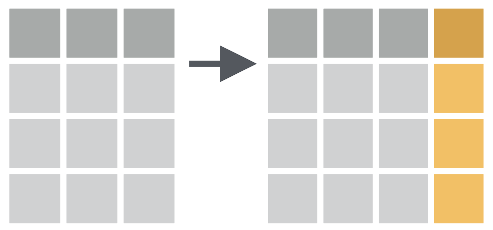

```{r setup, include=FALSE}
options(htmltools.dir.version = FALSE)
knitr::opts_chunk$set(
  collapse = TRUE,
  fig.retina = 3,
  comment = ""
)

library(ymlthis)
library(emo)
library(emojifont)
library(tidyverse)
library(fontawesome)
library(magick)
library(icon)
library(xaringanExtra)
xaringanExtra::use_tachyons()
xaringanExtra::use_tile_view()
xaringanExtra::use_webcam()
xaringanExtra::use_fit_screen()
xaringanExtra::use_extra_styles(hover_code_line = TRUE, mute_unhighlighted_code = TRUE)
#xaringanExtra::use_share_again()
xaringanExtra::use_panelset()
#<a class="footer-link" href="https://r4b.netlify.app/">r4b/share</a>
```

layout: true

---

class: title-slide, hide-count, middle
background-image: url(images/02-wrangling/cover1.jpg)
background-size: cover
background-position: 

.pull-left[
# .center.b.white[Data <br>Wrangling]

# .center.b.ttc.f3.white[`r rmarkdown::metadata$subtitle` | `r rmarkdown::metadata$author`]
<br><br><br>
]

---

# Check that:

 `r emo::ji("check")` internet is working on your computer

`r emo::ji("check")` you are working in your RStudio Project

`r emo::ji("check")` keep a notebook ready to write technical terms

---

class: center
background-image: url(images/02-wrangling/data-science-wrangle.png)
background-size: 75%
background-position: 50% 55%

# Course Progress

---

# Objectives:

1.   To import & export data

--

1.   To perform data manipulation for rows

--

1.   To perform data manipulation for columns

--

1.   To calculate summary statistics for the variables

---

# Data wrangling:

--

- "data exploration and data manipulation" [(Jesse Mostipak)](https://www.kaggle.com/jessemostipak/dive-into-dplyr-tutorial-1)

--

- "tidying and transforming" [(Hadley & Garrett)](https://r4ds.had.co.nz/index.html)

---

background-image: url(images/02-wrangling/tidy-1.png)
background-size: 75%
background-position: 50% 55%

# "Tidying" data means:

- "each column is a variable, and each row is an observation" [(Hadley & Garrett)](https://r4ds.had.co.nz/index.html)

---

# "Transforming" data means:

- "narrowing in on observations of interest ... 

--

- creating new variables that are functions of existing variables ... and

--

- calculating a set of summary statistics." [(Hadley & Garrett)](https://r4ds.had.co.nz/index.html)

---

class: inverse, center, middle, hide-count

# .big-text[Data]

---

background-image: url(images/02-wrangling/palmer.png)
background-size: 70%
background-position: 95% 65%

# Palmer penguins data

- [Palmer Staion, Antarctica LTER](https://pal.lternet.edu/)

---

background-image: url(images/02-wrangling/lter_penguins.png)
background-size: 55%
background-position: 95% 70%

# Penguin data variables

- `r names(penguins)`

.footnote[
Artwork by [@allison_horst](https://www.allisonhorst.com/)
]

---

background-image: url(images/02-wrangling/culmen_depth.png)
background-size: 55%
background-position: 95% 70%

# Penguin data variables

- `r names(penguins)`

.footnote[
Artwork by [@allison_horst](https://www.allisonhorst.com/)
]

---

class: middle, inverse, hide-count
background-image: url(images/02-wrangling/readr.svg)
background-size: 40%
background-position: 95% 50%

.pull-left[
# .center.big-text[`readr` <br>pkg]
]

---

background-image: url(images/02-wrangling/readr.svg)
background-size: 7%
background-position: 90% 5%

# `readr` pkg

- "to provide a fast and friendly way to read **rectangular** data (like csv, tsv, and fwf)".

--

- function is `read_csv()`

.footnote[
Source: [tidyverse](https://readr.tidyverse.org/)
]

---

.panelset[

.panel[.panel-name[Codes]

```{r imp-data, eval=FALSE}
# import data
library(readr)

penguins <- read_csv("data/penguins.csv")

penguins

```

]

.panel[.panel-name[Output]

```{r ref.label="imp-data", echo=FALSE, message=FALSE}

```

]
]

---

# Variable types in R:

- `int` stands for integers, like 4, 55, 300.

--

- `dbl` stands for doubles, or real numbers like 3, 7.45, 1.565, 12.

--

- `chr` stands for character vectors, or strings.

--

- `dttm` stands for date-times (a date + a time).

--

- `lgl` stands for logical, vectors that contain only TRUE or FALSE.

--

- `fct` stands for factors, which R uses to represent categorical variables with fixed possible values.

--

- `date` stands for dates.

---

# Change variable types in penguin data:

1. `species` : a **factor** denoting penguin species (Adélie, Chinstrap and Gentoo)

--

1. `island` : a **factor** denoting island in Palmer Archipelago, Antarctica (Biscoe, Dream or Torgersen)

--

1. `bill_length_mm` : a **number** denoting bill length (millimeters)

--

1. `bill_depth_mm` : a **number** denoting bill depth (millimeters)

--

1. `flipper_length_mm` :  an **integer** denoting flipper length (millimeters)

--

1. `body_mass_g` : an **integer** denoting body mass (grams)

--

1. `sex` : a **factor** denoting penguin sex (female, male)

--

1. `year` : an **integer** denoting the study year (2007, 2008, or 2009)

---

.panelset[

.panel[.panel-name[Codes]

```{r col-types, eval=FALSE}
penguins <- read_csv("data/penguins.csv",
  col_types = cols( 
    species = col_factor(),
    island = col_factor(),
    bill_length_mm = col_double(),
    bill_depth_mm = col_double(),
    flipper_length_mm = col_integer(),
    body_mass_g = col_integer(),
    sex = col_factor(),
    year = col_integer()
  )
)

penguins
```
]

.panel[.panel-name[Output]

```{r ref.label="col-types", echo=FALSE, message=FALSE}

```

]
]

---

.panelset[

.panel[.panel-name[Codes]

```{r summ-data2, eval=FALSE}
summary(penguins)
```
]

.panel[.panel-name[Output]

```{r ref.label="summ-data2", echo=FALSE, message=FALSE}

```

]
]

---

class: middle, inverse, hide-count
background-image: url(images/02-wrangling/logo-skimr.png)
background-size: 40%
background-position: 95% 55%

.pull-left[
# .center.big-text[`skimr` pkg]
]

---

background-image: url(images/02-wrangling/logo-skimr.png)
background-size: 10%
background-position: 93% 1%

# `skimr` pkg

- "displaying summary statistics the user can skim quickly to understand their data"

- function is `skim()`

.footnote[
Source: [rOpenSci](https://docs.ropensci.org/skimr/) 
]

---

.panelset[

.panel[.panel-name[Codes]

```{r summ-data, eval=FALSE}
# install.packages("skimr")

library(skimr)

skim(penguins)
```
]

.panel[.panel-name[Output]

```{r ref.label="summ-data", echo=FALSE, message=FALSE}

```

]
]

---

class: middle, inverse, hide-count
background-image: url(images/02-wrangling/dplyr.svg)
background-size: 60%
background-position: 100% 60%

.pull-left[
# .center.big-text[`dplyr` pkg]
]
---

background-image: url(images/02-wrangling/logo-dplyr.png)
background-size: 10%
background-position: 97% 5%

# `dplyr` pkg to

1. to get an overview of data use `glimpse()`.

--

1. "Pick observations by their values `filter()`."

--

1. "Reorder the rows `arrange()`."

--

1. "Pick variables by their names `select()`."

--

1. "Create new variables with functions of existing variables `mutate()`."

--

1. "Collapse many values down to a single summary `summarise()`."

.footnote[
Source: [Hadley & Garrett](https://r4ds.had.co.nz/transform.html) & [tidyverse](https://dplyr.tidyverse.org/)
]

---

.panelset[

.panel[.panel-name[Codes]

```{r glmp-data, eval=FALSE}
library(dplyr)

glimpse(penguins)
```
]

.panel[.panel-name[Output]

```{r ref.label="glmp-data", echo=FALSE, message=FALSE}

```

]
]

---

# `filter()` function

- "Pick observations by their values."

```{r filter-img, echo=FALSE, fig.align='center'}
knitr::include_graphics("images/02-wrangling/01-filter.png")
```

---

.panelset[

.panel[.panel-name[Codes]

```{r filter-fun, eval=FALSE}
# three species are Chinstrap, Gentoo, Adelie
penguins %>% 
  filter(species == "Gentoo")
```
]

.panel[.panel-name[Output]

```{r ref.label="filter-fun", echo=FALSE, message=FALSE}

```

]
]

---

# Comparison: Relational Operators

`x < y`

--

`x > y`

--

`x <= y`

--

`x >= y`

--

`x == y` (equal)

--

`x != y` (not equal)

---

.panelset[

.panel[.panel-name[Codes]

```{r filter-fun2, eval=FALSE}
penguins %>% 
  filter(bill_length_mm > 43)
```
]

.panel[.panel-name[Output]

```{r ref.label="filter-fun2", echo=FALSE, message=FALSE}

```

]
]

---

.panelset[

.panel[.panel-name[Codes]

```{r filter-fun3, eval=FALSE}
penguins %>% 
  filter(species == "Gentoo",
         bill_length_mm > 45)
```
]

.panel[.panel-name[Output]

```{r ref.label="filter-fun3", echo=FALSE, message=FALSE}

```

]
]

---

.panelset[

.panel[.panel-name[Codes]

```{r filter-fun4, eval=FALSE}
penguins %>% 
  filter(species != "Gentoo",
         bill_length_mm > 45,
         body_mass_g > 4000)
```
]

.panel[.panel-name[Output]

```{r ref.label="filter-fun4", echo=FALSE, message=FALSE}

```

]
]

---

.panelset[

.panel[.panel-name[Codes]

```{r filter-fun41, eval=FALSE}
penguins %>% 
  filter(species != "Gentoo",
         bill_length_mm > 45,
         body_mass_g > 4000) %>% 
  head()
```
]

.panel[.panel-name[Output]

```{r ref.label="filter-fun41", echo=FALSE, message=FALSE}

```

]
]


---

# dplyr function `arrange()`:

- chooses rows based on column values.

<br>

```{r arrange-img, echo=FALSE, fig.align='center'}
knitr::include_graphics("images/02-wrangling/02-arrange.png")
```

---

# dplyr function `select()`:

- chooses rows based on column values.

<br>

```{r select-img, echo=FALSE, fig.align='center'}
knitr::include_graphics("images/02-wrangling/03-select.png")
```

---

# dplyr function `mutate()`:

- chooses rows based on column values.

<br>

```{r mutate-img, echo=FALSE, fig.align='center'}

```

---

# dplyr function `summarise()`:

- chooses rows based on column values.

<br>

```{r summ-img, echo=FALSE, fig.align='center'}
knitr::include_graphics("images/02-wrangling/05-summarise.png")
```


---

background-image: url(images/02-wrangling/logo-dplyr.png)
background-size: 10%
background-position: 97% 5%

# `arrange()` function:

- changes the order of the rows.

---

.panelset[

.panel[.panel-name[Codes]

```{r arg-fun, eval=FALSE}
penguins %>% 
  arrange(body_mass_g)
```
]

.panel[.panel-name[Output]

```{r ref.label="arg-fun", echo=FALSE, message=FALSE}

```

]
]

---

.panelset[

.panel[.panel-name[Codes]

```{r arg-fun2, eval=FALSE}
penguins %>% 
  arrange(desc(body_mass_g))
```
]

.panel[.panel-name[Output]

```{r ref.label="arg-fun2", echo=FALSE, message=FALSE}

```

]
]

---

.panelset[

.panel[.panel-name[Codes]

```{r arg-fun3, eval=FALSE}
penguins %>% 
  arrange(species) %>% 
  tail()
```
]

.panel[.panel-name[Output]

```{r ref.label="arg-fun3", echo=FALSE, message=FALSE}

```

]
]

---

background-image: url(images/02-wrangling/logo-dplyr.png)
background-size: 10%
background-position: 97% 5%

# `select()` function

- changes whether or not a column is included.

---

.panelset[

.panel[.panel-name[Codes]

```{r col-fun1, eval=FALSE}
penguins %>% 
  select(species)
```
]

.panel[.panel-name[Output]

```{r ref.label="col-fun1", echo=FALSE, message=FALSE}

```

]
]

---

.panelset[

.panel[.panel-name[Codes]

```{r col-fun2, eval=FALSE}
penguins %>% 
  select(species : bill_depth_mm)
```
]

.panel[.panel-name[Output]

```{r ref.label="col-fun2", echo=FALSE, message=FALSE}

```

]
]

---

.panelset[

.panel[.panel-name[Codes]

```{r col-fun3, eval=FALSE}
penguins %>% 
  select(4:8)
```
]

.panel[.panel-name[Output]

```{r ref.label="col-fun3", echo=FALSE, message=FALSE}

```

]
]

---

.panelset[

.panel[.panel-name[Codes]

```{r col-fun4, eval=FALSE}
penguins %>% 
  select(species, body_mass_g, year)
```
]

.panel[.panel-name[Output]

```{r ref.label="col-fun4", echo=FALSE, message=FALSE}

```

]
]

---

.panelset[

.panel[.panel-name[Codes]

```{r col-fun5, eval=FALSE}
penguins %>% 
  select(-c(species, body_mass_g, year))
```
]

.panel[.panel-name[Output]

```{r ref.label="col-fun5", echo=FALSE, message=FALSE}

```

]
]

---

background-image: url(images/02-wrangling/logo-dplyr.png)
background-size: 10%
background-position: 97% 5%

# `mutate()` function

- changes the values of columns and creates new columns.

---

.panelset[

.panel[.panel-name[Codes]

```{r col-fun7, eval=FALSE}
penguins %>% 
  mutate(body_mass_g = body_mass_g / 1000)
```
]

.panel[.panel-name[Output]

```{r ref.label="col-fun7", echo=FALSE, message=FALSE}

```

]
]

---

.panelset[

.panel[.panel-name[Codes]

```{r col-fun8, eval=FALSE}
penguins %>% 
  mutate(body_mass_g = body_mass_g / 1000,
         bill = bill_length_mm * bill_depth_mm)
```
]

.panel[.panel-name[Output]

```{r ref.label="col-fun8", echo=FALSE, message=FALSE}

```

]
]

---

background-image: url(images/02-wrangling/logo-dplyr.png)
background-size: 10%
background-position: 97% 5%

# [`dplyr`](https://www.rdocumentation.org/packages/dplyr/versions/0.7.8) functions based upon:

--

.panelset[

.panel[.panel-name[Rows]

- `filter()` chooses rows based on column values.
    
- `slice()` chooses rows based on location.
    
- `arrange()` changes the order of the rows.
    
]

.panel[.panel-name[Columns]

- `select()` changes whether or not a column is included.
    
- `rename()` changes the name of columns.
    
- `mutate()` changes the values of columns and creates new columns.
    
- `relocate()` changes the order of the columns.
    
.panel[.panel-name[Groups of rows]

- `summarise()` collapses a group into a single row.

]
]
]


