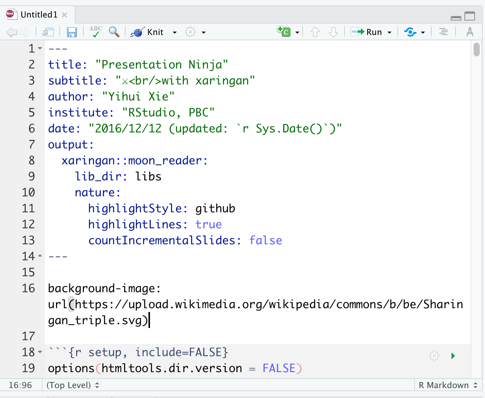
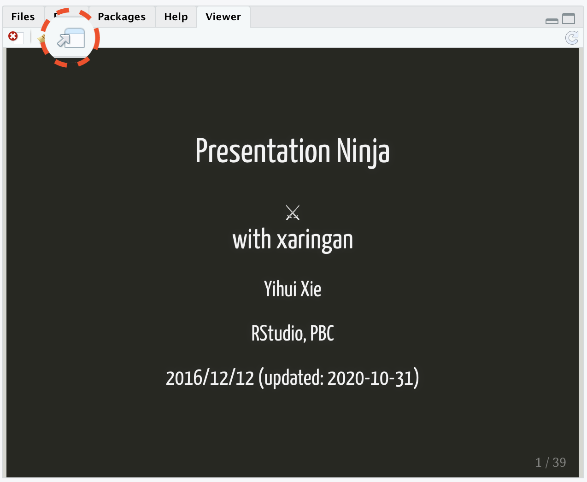

```{r setup, include=FALSE}
options(htmltools.dir.version = FALSE)
knitr::opts_chunk$set(
  collapse = TRUE,
  fig.retina = 3,
  comment = "",
  echo = F
)
library(ymlthis)
library(emo)
library(emojifont)
library(tidyverse)
library(fontawesome)
library(magick)
library(icon)
library(xaringanExtra)
xaringanExtra::use_tachyons()
xaringanExtra::use_tile_view()
xaringanExtra::use_webcam()
xaringanExtra::use_fit_screen()
xaringanExtra::use_extra_styles(hover_code_line = TRUE, mute_unhighlighted_code = TRUE)
#xaringanExtra::use_share_again()
xaringanExtra::use_panelset()
#<a class="footer-link" href="https://r4b.netlify.app/">r4b/share</a>
options(htmltools.dir.version = FALSE, htmltools.preserve.raw = FALSE)
```

layout: true

---

class: title-slide, hide-count, middle, center

background-image: url(images/06-slides/xaringan-logo.png)
background-size: 35%
background-position: 95% 

.pull-left[
# .center.b.navy[`r rmarkdown::metadata$title`]

# .center.b.ttu.f3.white.bg-red.pv1[By: `r rmarkdown::metadata$author`]

]

---

background-image: url("images/06-slides/xaringan-logo.png")
background-size: 10%
background-position: 90% 5%

# xaringan

- xaringan package to be a Presentation Ninja `r emo::ji("sword")`

--

- "for creating slideshows with remark.js through R Markdown"

--

- [Xie Yihui](https://yihui.org/en/)

```{r hadley, echo=FALSE, out.width="42%", fig.align='center'}
knitr::include_graphics("https://usesthis.com/images/interviews/yihui.xie/portrait.jpg")
```

.footnote[
Source: [xaringan github page](https://github.com/yihui/xaringan)
]

---

# Packages required: 

```{r pkgs, echo=TRUE}
library(palmerpenguins) # to access penguin data

library(xaringan) 
```

---
class: center

# File $\longrightarrow$ New File $\longrightarrow$ R Markdown

```{r out.width="100%"}
knitr::include_graphics("images/06-slides/rmd-new.png")
```


---
class: center

# Template $\rightarrow$ Ninja Presentation

```{r out.width="50%"}
knitr::include_graphics("images/06-slides/xar1.png")
```

---
class: center

# Save this Rmd file

```{r out.width="50%"}

```

---
class: center

.pull-left[
### Addins $\rightarrow$ Inifinite Moon Reader

```{r out.width="65%"}
knitr::include_graphics("images/06-slides/xar3.png")
```
]

--

.pull-right[

### xaringan output 

```{r }
knitr::include_graphics("images/06-slides/xar4.png")
```
]

---
class: center

.pull-left[
### Addins $\rightarrow$ Inifinite Moon Reader

```{r out.width="65%"}
knitr::include_graphics("images/06-slides/xar3.png")
```
]

.pull-right[

### xaringan slide $\rightarrow$ browser 

```{r }

```
]

--

- We need to click `Inifinite Moon Reader` only to start the slideshow. To see the changes made in the slides just save the document `ctrl + s`

---

# Using xaringan how to:

--

1. create a new slide

--

1. hide an existing slide

--

1. heading, subheadings, points and normal text

--

1. include images

--
    - as background
--
    - as part of slide
--

1. make plots

--

1. include tables

--

1. in-text R output

--

1. create columns

---

#1. Use `---` to create a new slide

---

#2. `exclude:true` To hide an existing slide

---

#3. Slide text sizes:

--

#- `#` for main heading

--

##- `##` for sub-heading

--

###- `####` for sub-sub-heading

--

  * indented `*` for sub-point1
  * indented `*` for sub-point2
  * indented `*` for sub-point3

--

- `-` for normal text size

---

# To include images using:

###  CSS `background` option:

--

- `background-image: url("path of the image")` = path of the image

--

- `background-size: contain, cover, 50%, 70%` = size of the image

--

- `background-position: left top` = position of the image

---

# To include images using:

###  `knitr` chunk option:

```{r eval=FALSE, echo=TRUE, out.width="45%", fig.align="center"}
knitr::include_graphics("path of the image")
```

---

# To include plots

```{r}
library(palmerpenguins)
ggplot(penguins, aes(x = species)) +
  geom_bar()
```

---

# To include tables

```{r message=FALSE, echo=TRUE}
library(kableExtra)
library(tidyverse)

penguins %>% 
  drop_na() %>% 
  head() %>% 
  kable() 

```

---

# in-text R output

- penguins data have a sample of $n$ = `r nrow(penguins)` on total `r ncol(penguins)` variables.

--

- math expressions 

$a + b = \sigma - \sum{x}_2^2$

---

# Column division of slide


.pull-left[
##- left column

- a

  - b
  - c
]

.pull-right[
##- right column

- apple
- boy
- cat
]

---

# Slide `class`

- class can be assigned to each slide

--

- it decides how all elements of one particular slide will look like

---
class: center

# Slide `class`

- class can be assigned to each slide

- it decides how all elements of one particular slide will look like

---
class: center, middle, inverse, right

# Slide `class`

- class can be assigned to each slide

- it decides how all elements of one particular slide will look like

---

# extend the power of xaringan:

--

- using R packages like [xaringanExtra](https://pkg.garrickadenbuie.com/xaringanExtra/#/README?id=xaringanextra)

--

- learn little about [CSS](https://www.w3schools.com/css/)

--

- use [cheatsheets](https://rstudio.com/resources/cheatsheets/)

---

class: inverse, center, middle, hide-count

# .big-text[Thank you <br>so much `r emo::ji("smile")`]

---
background-image: url("images/06-slides/firework.gif")
background-size: cover

class: center, middle

.white.big-text[Amy, Estibaliz, Mamta & Musa <br> congratulations !!! <br> `r emo::ji("party")` `r emo::ji("party")` `r emo::ji("party")` ]

